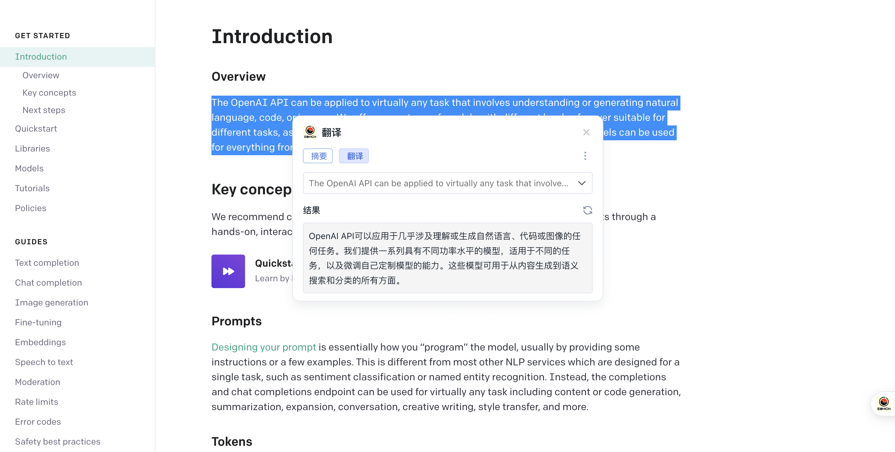

# echo

### 介绍

Chat GPT chrome extension 助手，类似 monica

### 使用说明

#### 扩展程序包

1、点击<a target="_blank" href="https://help-doc.oss-cn-beijing.aliyuncs.com/echo-pro.zip?t=1683296881129">下载</a>，下载扩展程序压缩包

2、打开 chrome 浏览器，点击”chorme“=>”窗口“=>"扩展程序"

3、将下载的扩展程序包解压后，拖入扩展程序页安装即可

#### 本地安装

1、clone 当前项目

`git clone https://github.com/hzvwsrexw15/echo.git`

2、安装依赖

`npm install`

3、本地打包

`npm run build`

4、在 chrome 扩展程序中使用，点击”chorme“=>”窗口“=>"扩展程序"=>"加载已解压的扩展程序"，选择项目目录即可
