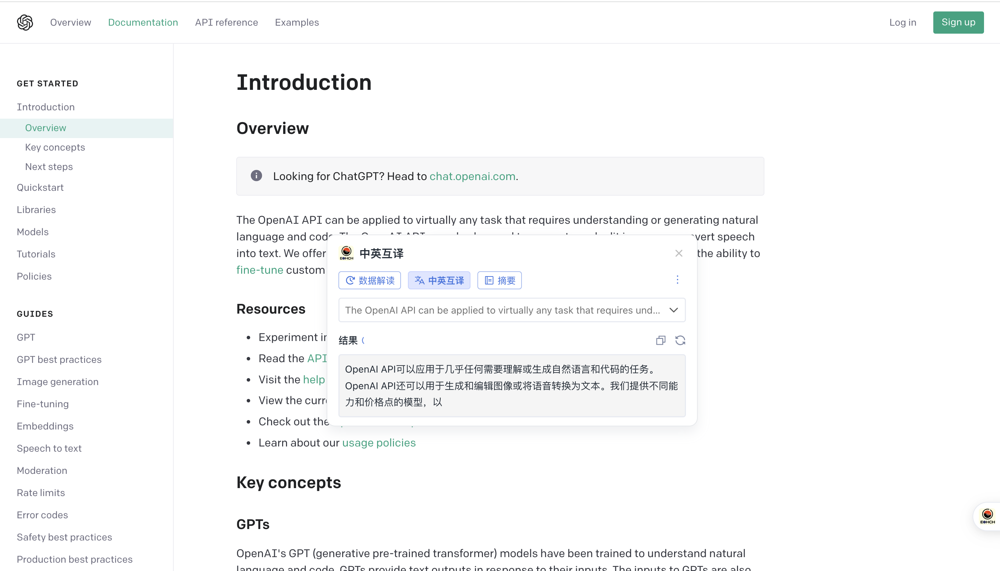
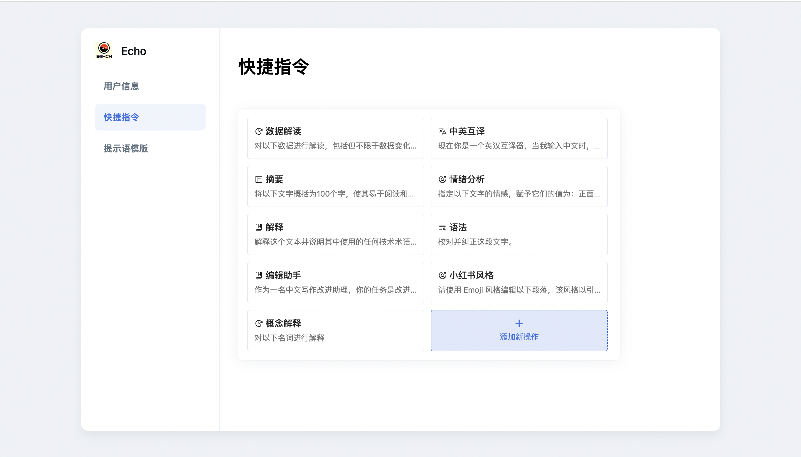
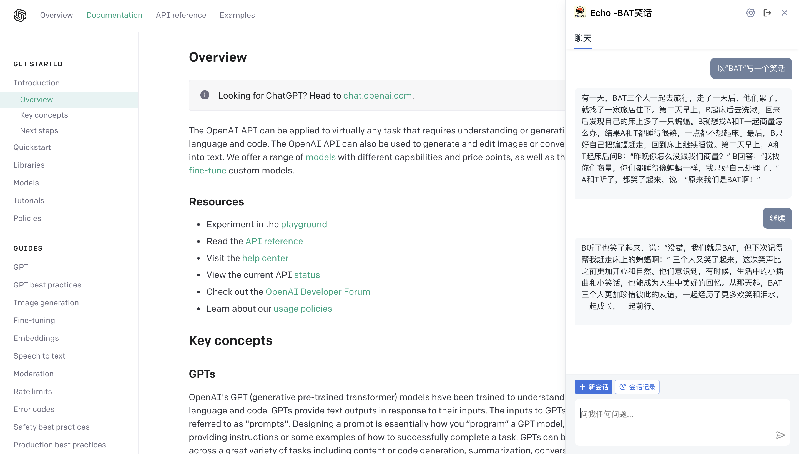
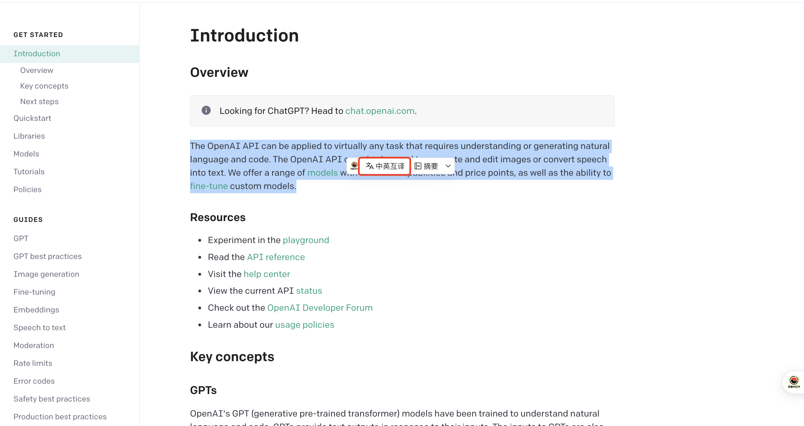
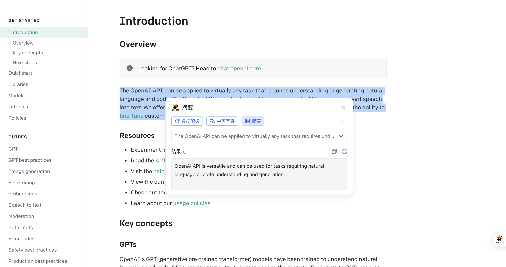
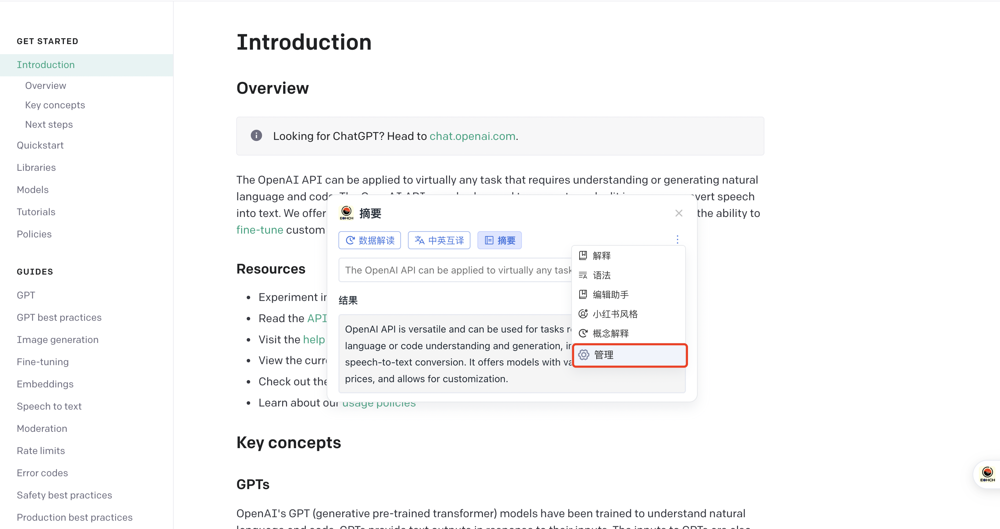
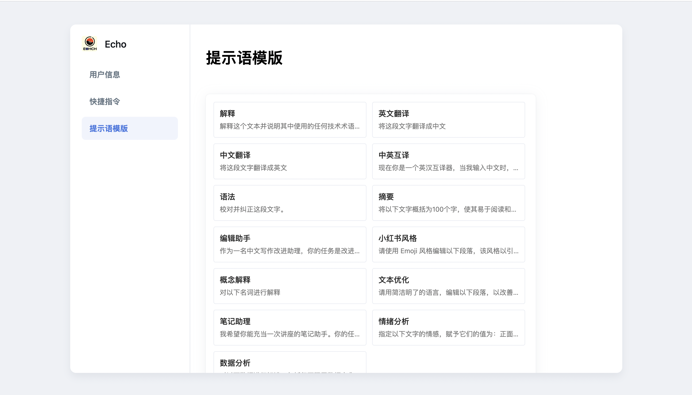
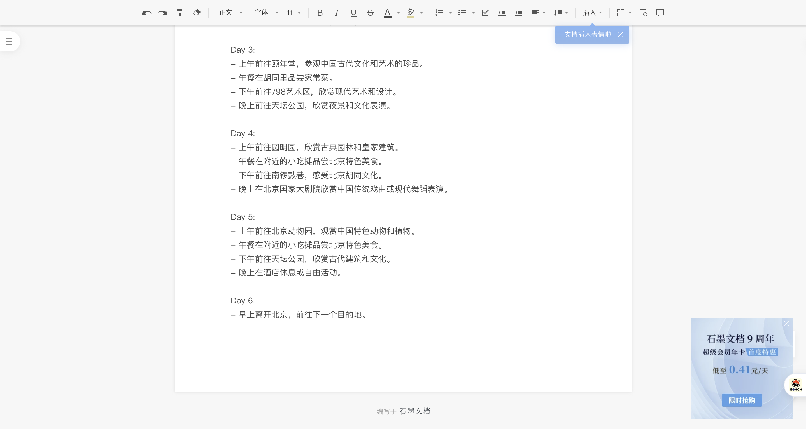
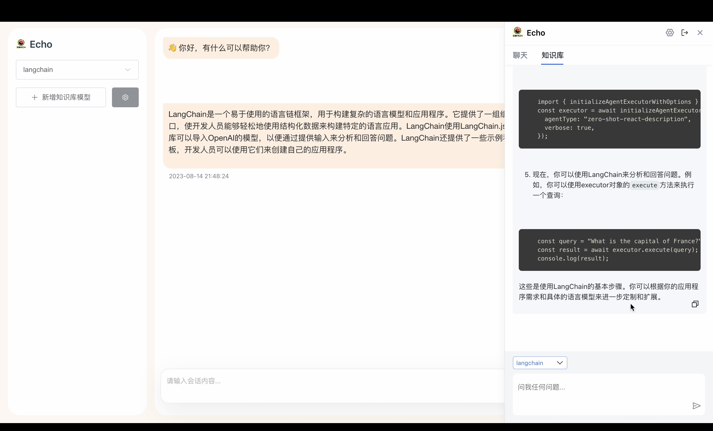
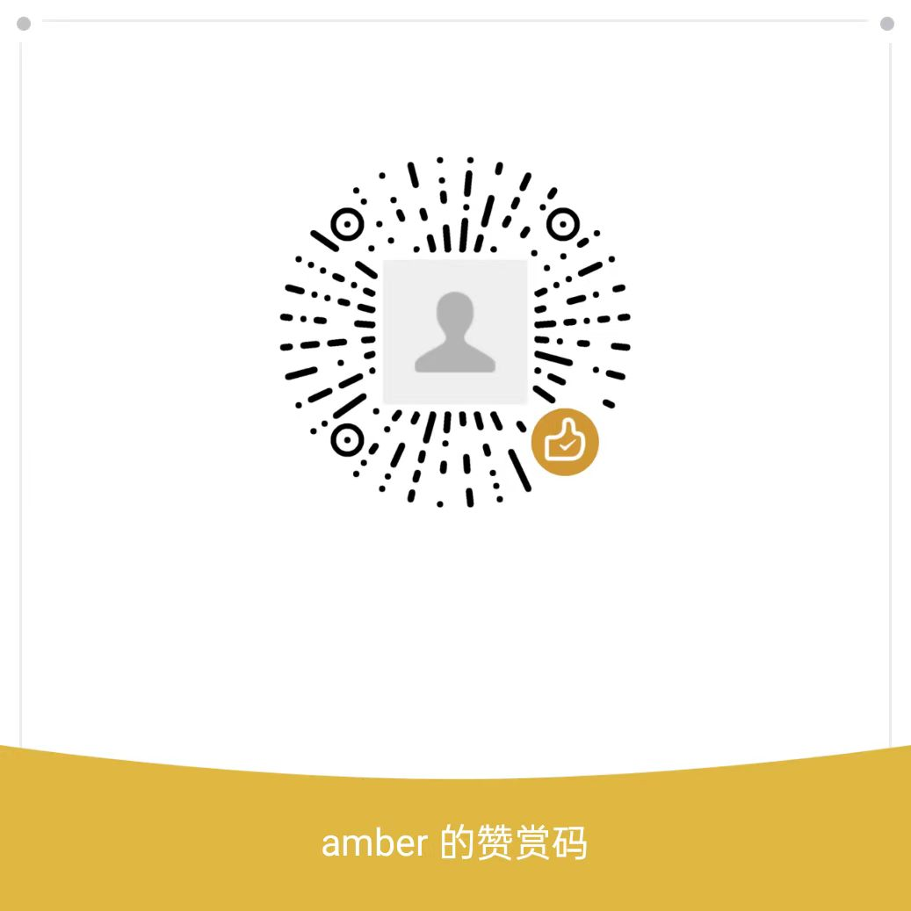

# Echo

### 介绍

Chat GPT chrome extension 助手，类似 monica，基于 GPT-3.5 API，免费使用，目前有以下功能：

- 一键处理选中文本：支持在页面中选择文本，并对文本进行快捷处理，如翻译、摘要、解释等

  

- 自定义快捷处理：在默认选项基础上，支持自定义快捷处理方式，如数据解读、情绪分析等

  

- 随时聊天：与 chatGPT 一样，可随时进行会话及聊天，回答你提出的所有问题

  

- 写作辅助：与 notion AI 类似，能够直接在编辑文档处根据您的诉求，直接帮你完成写作内容，目前支持石墨文档、腾讯文档

  

### 安装

#### 扩展程序包

1、点击<a target="_blank" href="https://help-doc.oss-cn-beijing.aliyuncs.com/echo-pro.zip?t=1691934757419">下载</a>，下载扩展程序压缩包

2、打开 chrome 浏览器，点击”chorme“=>”窗口“=>"扩展程序"(或<a target="_blank" href="chrome://extensions/">点击链接</a>打开 chrome extension 配置)

3、将下载的扩展程序包解压后，拖入扩展程序页安装即可

#### 本地安装

1、clone 当前项目

`git clone https://github.com/hzvwsrexw15/echo.git`

2、安装依赖

`npm install`

3、本地打包

`npm run build`

4、在 chrome 扩展程序中使用，点击”chorme“=>”窗口“=>"扩展程序"=>"加载已解压的扩展程序"(或<a target="_blank" href="chrome://extensions/">点击链接</a>打开 chrome extension 配置)，选择项目目录即可

### 如何使用

#### 处理选中文本

1. 插件安装完成后，随便打开一个网站，在站点中选择文本，并根据自己需要，选择快捷操作，如下：

   

2. 点击快捷操作，如”中英互译“：

   

3. 也可选择其他操作，如”摘要“：

   

#### 自定义快捷指令

当无满足需求的快捷指令时，可自定义配置

#### 提示语模板

如果初次使用不清楚如何配置或配置哪些快捷指令，可参考”提示语模板“

#### 会话聊天

1. 点击”Echo“图标，可进入直接会话界面，如下图标

   

2. 点击图标后，可进入会话页面，并输入会话内容，即可与 AI 进行会话,也可在会话界面查看历史会话记录

   
   

#### 写作辅助

在进行在线文档写作过程中，可使用”ctrl + m“快捷键，调出 Echo 会话界面，输入需要协助的内容后，按 Enter，便自动将内容写入文档，目前支持石墨文档、腾讯文档
如，进入石墨文档，在编辑页中，按”ctrl + m“快捷键，输入”给一份北京旅游计划“后，按 enter，结果如下：

#### 知识库

### 反馈建议

1. 提 <a href="https://github.com/hzvwsrexw15/echo/issues">Issues</a>

2. 添加微信，直接反馈

   

### 赞助

我们知道不是每个人都有能力为工具和内容付费，所以我们免费地提供这个工具给所有需要的人，但目前 openAI API 仍需付费使用，为了更好的为大家提供服务，也期望有能力的人提供一些支持，你们的支持是我们最大的动力。

